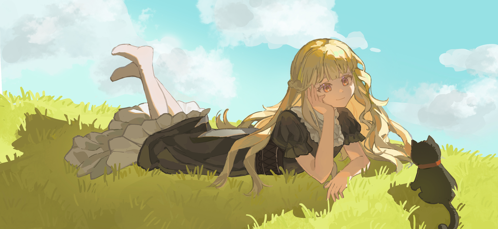

+++
author = "UlilS"
title = "春日"
date = "2026-05-16"
description = ""
categories = [
    "绘画"
]
tags = [
    
]
image = ""
+++

最近在搓oc游戏，为了确定美术概念而速速摸了一张主角图。介绍一下，她叫波波娜，是一个女巫，喜欢糖果和魔药，目前正经营着一家魔药奶茶店。

因为想塑造出温馨惬意的氛围，所以选择了阳光下的草地作为场景，角色打光用了逆光。这次我拉开了明暗面对比度，重点细化暗面，画了很多环境反光，这和我之前的作画习惯完全不同，但结果好像还挺好的。

虽然画草地和云是个大麻烦，但是也算水完了，皆大欢喜。草地可以用粗糙的笔刷，刷不同的颜色块，然后再添上草，观感会好一些。云我是先起块面，然后直接用笔刷糊的，感觉有点太糊了，幸好占比不大，不然该穿帮了。

 




